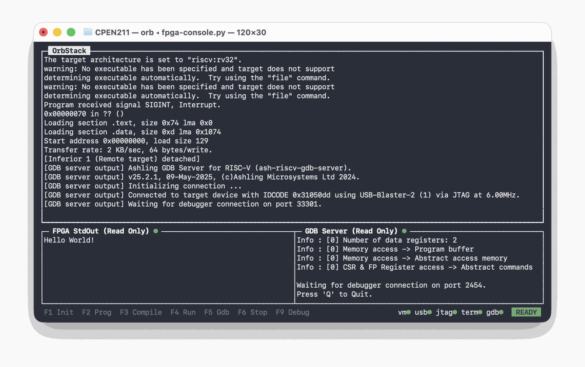
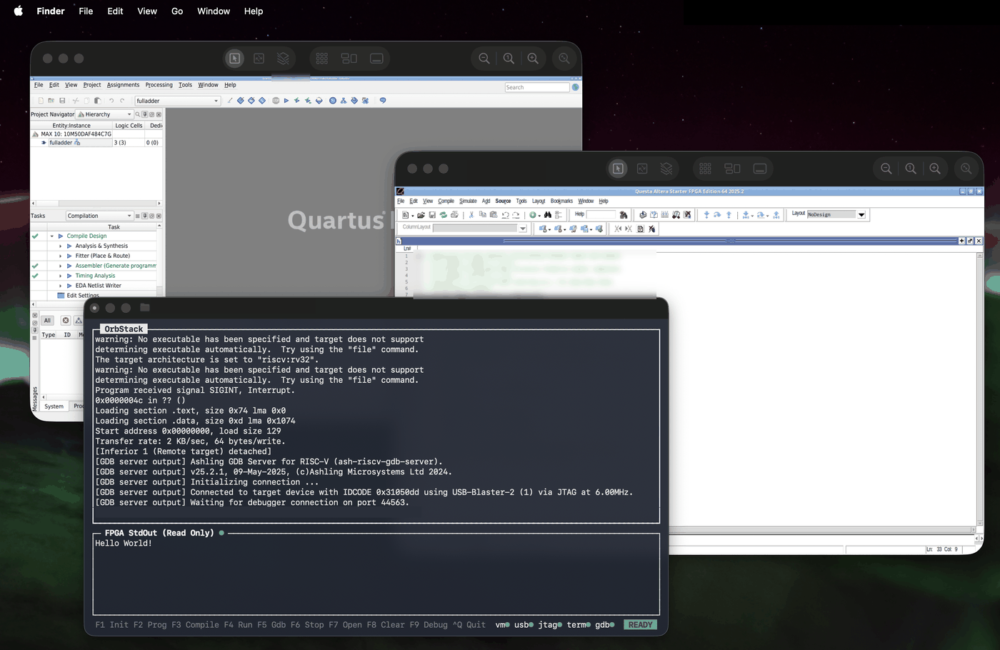

# cpen-tools for CPEN 211

A set of scripts and tools aimed at streamlining CPEN 211 on Apple Silicon
Macs, instead of the x86-64 Windows 11 the course expects. The toolchain
itself runs in an [OrbStack](https://orbstack.dev) Ubuntu VM; these drive it
from your Mac.



## Before you start

You need a Mac, a DE10-Lite or DE1-SoC, and about 30GB free.

The Quartus installer is behind a login, so it cannot be scripted. Download
it by hand first: make a free account at [altera.com](https://www.altera.com),
then get [Quartus Prime Lite 24.1 for Linux][dl], from the **Installer (SFX)**
tab. Leave `qinst-lite-linux-24.1std-1077.run` in your Downloads folder.

24.1 specifically. It is the version the course uses, and the 25.1 installer
crashes partway through on Apple Silicon.

[dl]: https://www.altera.com/downloads/fpga-development-tools/quartus-prime-lite-edition-design-software-version-24-1-linux

## Getting started

Paste this into the Terminal app. It may ask for access to your Downloads
folder.

```bash
git clone https://github.com/Horse-5-333/cpen-tools.git
cd cpen-tools
./bin/cpen-setup
```

Read the prompts and respond accordingly. The whole thing takes about half an
hour, most of it the Quartus install. Alternatively, follow the manual
install in [docs/SETUP.md](docs/SETUP.md), which is the same process written
out step by step with an explanation of each one.

`cpen-setup` is safe to re-run as many times as you like: every step checks
whether it is already done, so you can stop partway and continue later. It
stops with instructions at anything it cannot do for you.

`--check` reports without changing anything, `--report` does the same and
adds your versions in a form you can paste into an issue, `--no-gui` skips
the VNC desktop, `--no-native` skips Surfer, and `--no-path` leaves your
shell profile alone.

### What it changes

On your Mac:

| | |
|---|---|
| Installs, with Homebrew | OrbStack, Surfer |
| Installs, with Apple's own installer | Rosetta 2 |
| Creates | `~/.config/cpen-tools`, `~/.local/state/cpen-tools` |
| Appends one line to | your shell profile, putting `bin/` on `PATH` |

In a new amd64 Ubuntu VM it creates, named `altera`:

| | |
|---|---|
| Installs | Quartus Prime Lite, Questa, the Nios V tools, RISC-V compilers |
| Installs, with apt | build tools, fonts, and a minimal VNC desktop |
| Writes | a udev rule for the USB-Blaster, and a `PATH` line in `~/.bashrc` |

Two things it will not do for you, and stops to explain instead: installing
Homebrew and the Xcode Command Line Tools, which are Apple's and Homebrew's
own installers, and requesting the free Questa licence, which needs an
account and your VM's NIC ID. It never asks for your Mac password.

`cpen-uninstall` undoes all of it. It shows you everything it found and waits
for confirmation; `--all` also deletes the VM, `--dry-run` lists without
touching anything. It leaves Homebrew, the Command Line Tools, Rosetta,
OrbStack and Surfer alone, since those are general-purpose, and it never
touches your lab files.

## The tools

Every command opens in the directory you run it from, like any other
command. Detailed documentation for each one, with every flag and setting, is
in [docs/REFERENCE.md](docs/REFERENCE.md).

### cpen-setup

The installer, above. Also the checker: `cpen-setup --check` tells you what
is and is not in place without changing anything.

### cpen-nios and cpen-init

A TUI console for the Nios V assembly labs. It has panes for program output,
the GDB server, and a shell in the VM for running commands by hand, with the
function keys driving compile, run, program and debug.

USB passthrough to the VM can be finicky, and the JTAG cable allows only one
owner at a time, so `F1` automates that whole chain. `cpen-init` is the same
bring-up as a plain command, for when you are not in the console.

### cpen-verilog

Create, synthesize, compile and simulate SystemVerilog from your own
terminal. This can usually replace the Quartus and Questa GUIs entirely:

```bash
cpen-verilog NEWPROJECT TOP=fulladder   # write the .qpf, .qsf and a stub
cpen-verilog SYNTH                      # compile, producing your .sof
cpen-verilog PROGRAM_PROJECT            # load it onto the board
cpen-verilog SIM                        # run the testbench, headless
cpen-verilog WAVE                       # simulate, then open the waveform
cpen-verilog SCHEMATIC                  # draw a schematic and open it
```

Simulation needs a free Questa licence; `cpen-setup` prints the steps and
your NIC ID when it gets there.

### cpen-gui

Opens Quartus and Questa as windows on your Mac, over VNC, if you want to
follow a lab handout exactly. Most things work, but the windowing can be
unexpected.

```bash
cpen-gui            # Quartus
cpen-gui questa     # Questa
cpen-gui both       # both, in two windows
cpen-gui stop       # shut them down
```



Run it from a lab folder and Quartus opens that lab's project. The two get
separate screens at different sizes because they disagree about scaling;
[docs/REFERENCE.md](docs/REFERENCE.md) explains why. Each server binds only
to the VM's loopback, so nothing is exposed on any network.

Both are the real applications running in the VM, not a reimplementation,
so a lab handout's menu paths are the menu paths you get.

### cpen-uninstall

Undoes what `cpen-setup` changed, after showing you everything it found and
waiting for confirmation.

## Boards

| Board | Support | Reason |
|---|---|---|
| DE10-Lite | 🟩 | Fully supported and verified |
| DE1-SoC | 🟧 | Should work, with the fpgacademy `.sof` bitstream |
| DE10-Nano | 🟥 | Recognized, but needs an external Nios V `.sof` |
| DE10-Standard | 🟥 | Recognized, but needs an external Nios V `.sof` |
| Anything else | 😇 | Good luck. |

Those ratings are about the prebuilt Nios V bitstream, which only ships for
some boards. Building and programming **your own** Verilog bitstream needs
only the device and pins from your project's `.qsf`, so it should work on any
board Quartus supports.

## Verified on

| | |
|---|---|
| Mac | MacBook Air (M3, `Mac15,12`) |
| macOS | 26.6.2, build 25G83 |
| OrbStack | 2.2.3 (2020300) |
| VM | Ubuntu 26.04.1 LTS, amd64, kernel `7.0.14-orbstack` |
| Quartus | Prime Lite 24.1std.0, Build 1077, from scratch |
| Python | 3.13.0 |
| Board | DE10-Lite |

Also verified against an existing Quartus Prime Lite 25.1std.0 install: the
tools work with it, but its installer is the one that crashes, so 24.1 is
what `cpen-setup` and [docs/SETUP.md](docs/SETUP.md) use.

The Verilog path is verified end to end: the sample design from
[lamadaemon's guide][gist1], retargeted from Cyclone V to MAX 10, compiled in
30 seconds with 0 errors, programmed in 3 seconds, and blinked `LEDR0` on a
DE10-Lite.

## Troubleshooting

See [docs/TROUBLESHOOTING.md](docs/TROUBLESHOOTING.md).

Have you tried unplugging the board and plugging it back in? No, seriously,
that resolves most problems, as long as you run Initialize (`F1`) afterwards.

## Reporting your setup

Whether or not this works on your machine, please say so at
[Horse-5-333/cpen-tools](https://github.com/Horse-5-333/cpen-tools/issues).

One command writes everything the issue needs:

```bash
cpen-setup --report
```

If the install did not get far enough to put it on your `PATH`, `cd` back
to the `cpen-tools` folder you cloned and run it from there:

```bash
./bin/cpen-setup --report
```

Either way it prints your Mac, macOS build, OrbStack, VM, kernel, Quartus
and board, followed by the pass or fail of every install step, already
wrapped in a code block. It changes nothing, it runs to the end even on a
machine with none of this installed, and it strips your home directory and
username out before printing, so it is safe to paste in public.

There are two issue forms, one for each case, and they label themselves.
Both ask for the report and little else, since it already knows your
versions and which steps passed.

**Please do not paste lab code, handout text or a solution into an issue.**
This repository holds no course material by design, and it is public. If a
build failed on your own source, describe what it was doing and paste the
tool's message, not the file.

## Credit and license

The hard parts of the install were originally worked out in
[lamadaemon's Apple Silicon guide][gist1], which [docs/SETUP.md](docs/SETUP.md)
credits and builds on.

[gist1]: https://gist.github.com/Lama3L9R/15d8c6568bc4a97b2fa39fc8125375f8

MIT. The bundled `share/Makefile.linux` is derived from the Makefile
distributed with CPEN 211 Lab 0 and rewritten for Linux. It is included on
the same basis as the patched Makefile shared publicly on the course Piazza,
which had instructor endorsement.
